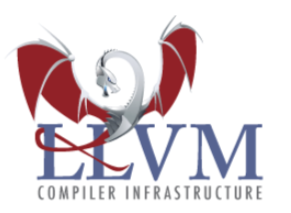
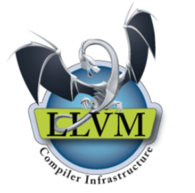

# LLVM

## LLVM

- 什么是LLVM

    - 官网:https://llvm.org/

    - The LLVM Project is a collection of modular and reusable compiler and toolchain technologies.

    - LLVM项目是模块化、可重用的**编译器**以及**工具链**技术的集合

    - 美国计算机协会 (ACM) 将其2012 年软件系统奖项颁给了LLVM，之前曾经获得此奖项的软件和技术包括:Java、Apache、 Mosaic、the World Wide Web、Smalltalk、UNIX、Eclipse等等

    

- 创始人
    - Chris Lattner，亦是Swift之父

    
    
 
 
 

- 有些文章把LLVM当做Low Level Virtual Machine(低级虚拟机)的缩写简称，官方描述如下:
    - The name "LLVM" itself is not an acronym; it is the full name of the project.
    - “LLVM“ 这个名称本身不是首字母缩略词; 它是项目的全名
 
 
 

- 图标长这样

    

- 还有这样

    

- 还有这样

    

 
 
 

## 传统的编译器架构
