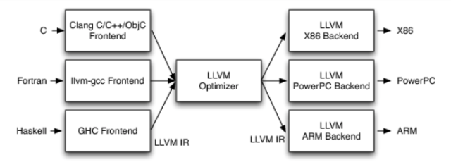

# LLVM

## LLVM

- 什么是LLVM

    - 官网:https://llvm.org/

    - The LLVM Project is a collection of modular and reusable compiler and toolchain technologies.

    - LLVM项目是模块化、可重用的**编译器**以及**工具链**技术的集合

    - 美国计算机协会 (ACM) 将其2012 年软件系统奖项颁给了LLVM，之前曾经获得此奖项的软件和技术包括:Java、Apache、 Mosaic、the World Wide Web、Smalltalk、UNIX、Eclipse等等

    

- 创始人
    - Chris Lattner，亦是Swift之父

    
    
 
 
 

- 有些文章把LLVM当做Low Level Virtual Machine(低级虚拟机)的缩写简称，官方描述如下:
    - The name "LLVM" itself is not an acronym; it is the full name of the project.
    - “LLVM“ 这个名称本身不是首字母缩略词; 它是项目的全名
 
 
 

- 图标长这样

    

- 还有这样

    

- 还有这样

    

 
 
 

## 传统的编译器架构

- Frontend:前端

    词法分析、语法分析、语义分析、生成中间代码

- Optimizer:优化器

    中间代码优化

- Backend:后端

    生成机器码
 
 
 
 

## LLVM架构

- 不同的前端后端使用统一的中间代码LLVM Intermediate Representation (LLVM IR)

- 如果需要支持一种新的编程语言，那么只需要实现一个新的前端

- 如果需要支持一种新的硬件设备，那么只需要实现一个新的后端

- 优化阶段是一个通用的阶段，它针对的是统一的LLVM IR，不论是支持新的编程语言，还是支持新的硬件设备，都不需要对优化阶段做修改

- 相比之下，GCC的前端和后端没分得太开，前端后端耦合在了一起。所以GCC为了支持一门新的语言，或者为了支持一个新的目标平台，就 变得特别困难
    
    > C-X86      
    > C-PowerPC  
    > C-ARM      
    > 
    > Fortran-X86        
    > Fortran-PowerPC    
    > ...                
    > ...                
    > 

- LLVM现在被作为实现各种静态和运行时编译语言的通用基础结构(GCC家族、Java、.NET、Python、Ruby、Scheme、Haskell、D等)

 
 
 

## Clang

- 什么是Clang?

    - LLVM项目的一个子项目

    - 基于LLVM架构的`C/C++/Objective-C`编译器**前端**

    - 官网:http://clang.llvm.org/

 

-  相比于GCC，Clang具有如下优点:

    - 编译速度快:在某些平台上，Clang的编译速度显著的快过GCC(Debug模式下编译OC速度比GGC快3倍)

    - 占用内存小:Clang生成的`AST`所占用的内存是GCC的五分之一左右

    - 模块化设计:Clang采用基于库的模块化设计，易于 IDE 集成及其他用途的重用

    - 诊断信息可读性强:在编译过程中，Clang 创建并保留了大量详细的元数据 (metadata)，有利于调试和错误报告

    - 设计清晰简单，容易理解，易于扩展增强

 
 
 

## Clang 与 LLVM

- 广义的LLVM

    整个LLVM架构

- 狭义的LLVM 

    LLVM后端(代码优化、目标代码生成等)

 

 
 
 

## OC源文件的编译过程

- 命令行查看编译的过程:`$ clang -ccc-print-phases main.m`

- 查看preprocessor(预处理)的结果:`$ clang -E main.m`

 
 
 

## 词法分析

- 词法分析，生成Token: `$ clang -fmodules -E -Xclang -dump-tokens main.m`

 

 
 
 

## 语法分析 （语法树-AST）

- 语法分析，生成语法树(AST，Abstract Syntax Tree): `$ clang -fmodules -fsyntax-only -Xclang -ast-dump main.m`

 

 
 
 

## LLVM IR (中间代码)

- `LLVM IR`有3种表示形式（但本质是等价的）
    - text：便于阅读的文本格式，类似于汇编语言，拓展名.ll， `$ clang -S -emit-llvm main.m`

    - memory：内存格式

    - bitcode：二进制格式，拓展名`.bc`， `$ clang -c -emit-llvm main.m`

- IR基本语法
    注释以分号 `;` 开头 
    全局标识符以@开头，局部标识符以%开头 
    `alloca`，在当前函数栈帧中分配内存 
    `i32，32bit`，4个字节的意思 
    `align`，内存对齐 
    `store`，写入数据 
    `load`，读取数据 

- 官方语法参考 
    https://llvm.org/docs/LangRef.html

    
 
 
 

## 源码下载

- 下载LLVM

    - `$ git clone https://git.llvm.org/git/llvm.git/`

    - 大小 `600+` M，仅供参考

- 下载Clang

    - `$ cd llvm/tools`

    - `$ git clone https://git.llvm.org/git/clang.git/`

    - 大小 `240+` M，仅供参考
 

 
 
 

## 源码编译

> 源码编译有两种方式:  
> 一种是用`cmake`和`ninja`进行编译，编译速度比较快，差不多十几分钟就编译完了。 
> 一种是通过Xcode进行编译，很方便，但是需要一个多小时。

 

### 1. 通过`cmake`和`ninja`编译

- 安装`cmake`和`ninja`(先安装brew，https://brew.sh/)

    - `$ brew install cmake`
    - `$ brew install ninja`

- `ninja`如果安装失败，可以直接从`github`获取`release`版放入【`/usr/local/bin`】中

    - https://github.com/ninja-build/ninja/releases

- 在`LLVM`源码同级目录下新建一个【`llvm_build`】目录(最终会在【`llvm_build`】目录下生成【`build.ninja`】)

    - `$ cd llvm_build`
    - `$ cmake -G Ninja ../llvm -DCMAKE_INSTALL_PREFIX=LLVM的安装路径`
    - 更多cmake相关选项，可以参考: https://llvm.org/docs/CMake.html

- 依次执行编译、安装指令

    - `$ ninja` 
        编译完毕后， 【`llvm_build`】目录大概 `21+` G(仅供参考)
    - `$ ninja install` 
        安装完毕后，安装目录大概 `11+` G(仅供参考)

 

### 2. 通过`Xcode`编译

- 先 生成`Xcode`项目再进行编译，但是速度很慢(可能需要1个多小时)

- 在`llvm`同级目录下新建一个【`llvm_xcode`】目录

    - `$ cd llvm_xcode`
    - `cmake -G Xcode ../llvm`

 

 
 
 

## 应用与实践

- `libclang`、`libTooling`

    - 官方参考: https://clang.llvm.org/docs/Tooling.html

    - 应用:`语法树分析`、`语言转换`等

- `Clang`插件开发

    - 官方参考  
        https://clang.llvm.org/docs/ClangPlugins.html  
        https://clang.llvm.org/docs/ExternalClangExamples.html  
        https://clang.llvm.org/docs/RAVFrontendAction.html  

    - 应用: `代码检查(命名规范、代码规范)`等

- `Pass`开发

    - 官方参考: https://llvm.org/docs/WritingAnLLVMPass.html

    - 应用: `代码优化`、`代码混淆`等

- **开发新的编程语言**
    - https://llvm-tutorial-cn.readthedocs.io/en/latest/index.html
    - https://kaleidoscope-llvm-tutorial-zh-cn.readthedocs.io/zh_CN/latest/

 
 
 

## `Clang`插件开发

### 1. 插件目录

- 在【`clang/tools`】源码目录下新建一个插件目录，假设叫做【`vvm-plugin`】

    

- 在【`clang/tools/CMakeLists.txt`】最后加入内容: `add_clang_subdirectory(vvm-plugin)`，小括号里是插件目录名

    

### 2. 插件必要文件

- 在【`vvm-plugin`】目录下新建一个【`CMakeLists.txt`】，文件内容是`:add_llvm_loadable_module(VVMPlugin VVMPlugin.cpp)`

    > VVMPlugin是插件名，VVMPlugin.cpp是源代码文件

    

    

### 3. 编写插件源码

    

### 4. 插件编译

- 利用`cmake`生成的`Xcode`项目来编译插件(第一次编写完插件，需要利用`cmake`重新生成一下`Xcode`项目)

    插件源代码在【`Sources/Loadable modules`】目录下可以找到，这样就可以直接在`Xcode`里编写插件代码

    选择`VVMPlugin`这个`target`进行编译，编译完会生成一个动态库文件

    

    

    

### 5. 加载插件

- 在`Xcode`项目中指定加载插件动态库:`BuildSettings > OTHER_CFLAGS`

    - `-Xclang -load -Xclang` 动态库路径 `-Xclang -add-plugin -Xclang` 插件名称

    

### 6. `Hack Xcode`

- 首先要对`Xcode`进行`Hack`，才能修改默认的编译器

    
